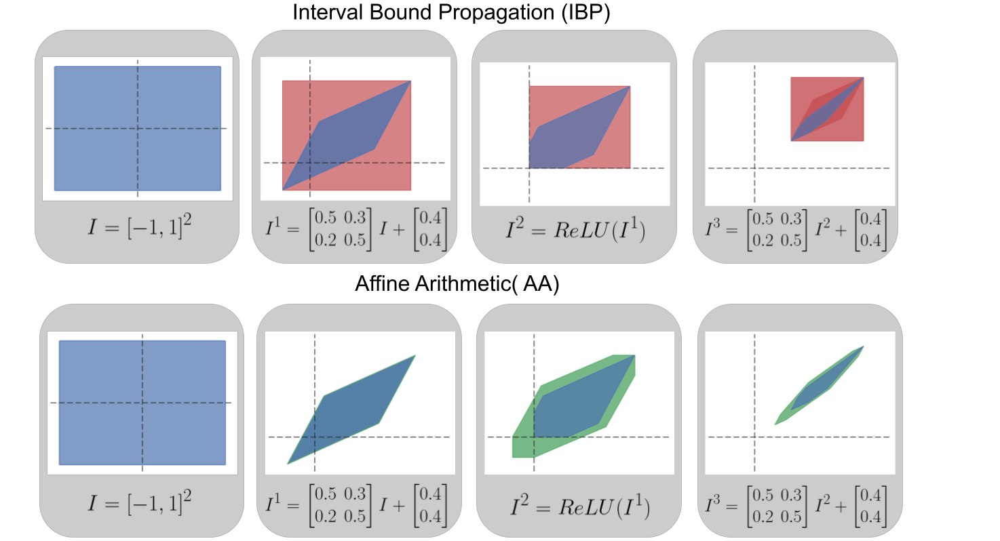

# Make Interval Bound Propagation great again

## Abstract
In various scenarios motivated by real life, such as medical data analysis, autonomous driving, and adversarial training, we are interested in robust deep networks. A network is robust when a relatively small perturbation of the input cannot lead to drastic changes in output (like change of class, etc.). This falls under the broader scope field of Neural Network Certification (NNC).
Two crucial problems in NNC are of profound interest to the scientific community: how to calculate the robustness of a given pre-trained network and how to construct robust networks. The common approach to constructing robust networks is Interval Bound Propagation (IBP). 
This paper demonstrates that IBP is sub-optimal in the first case due to its susceptibility to the wrapping effect. Even for linear activation, IBP gives strongly sub-optimal bounds. Consequently, one should use strategies immune to the wrapping effect to obtain bounds close to optimal ones. We adapt two classical approaches dedicated to strict computations -- Dubleton Arithmetic and Affine Arithmetic -- to mitigate the wrapping effect in neural networks. These techniques yield precise results for networks with linear activation functions, thus resisting the wrapping effect. As a result, we achieve bounds significantly closer to the optimal level than IBPs.

## Teaser
The Affine Arithmetic (AA) method is able to reduce the wrapping effect compared to the Interval Bound Propagation (IBP) method.

## Environment
1. Install [requirements](http://capd.ii.uj.edu.pl/html/capd_requirements.html) neccessary to build the [CAPD](https://github.com/CAPDGroup/CAPD) library. This library enables implementing methods described in our paper. 
2. Build the CAPD library as it is described [here](https://github.com/CAPDGroup/CAPD).
3. Install [rapidjson](https://rapidjson.org/) to read datasets from <code>.txt</code> files.
4. Use the <code>environment.yml</code> file to create a conda environment with the necessary libraries: <code>conda env create -f environment.yml</code>. These Python libraries enable neural network training by both standard and IBP training.

## Datasets
For the experiments and ablation study, we use 4 publicly available datasets:
* [MNIST](https://pytorch.org/vision/stable/generated/torchvision.datasets.MNIST.html)
* [CIFAR-10](https://pytorch.org/vision/stable/generated/torchvision.datasets.CIFAR10.html) 
* [SVHN](https://pytorch.org/vision/main/generated/torchvision.datasets.SVHN.html)
* [Digits](https://scikit-learn.org/stable/auto_examples/datasets/plot_digits_last_image.html)

The datasets may be downloaded when the algorithm runs.

## Usage
The folder <code>AffineAndDoubletonArithmetic</code> contains the necessary tools to calculate bounds using Affine Arithmetic (AA), Doubleton Arithmetic (DA), Interval Bound Propagation (IBP), and Lower Bound (LB). In the <code>main.cpp</code> file, the following functions are available:
* <code>runFullyConnectedTest</code> - to calculate bounds using the AA, DA, IBP, and LB methods for fully-connected networks.
* <code>runConvolutionalTest</code> - to calculate bounds using the AA, IBP, and LB methods for convolutional neural networks (CNNs).
* <code>runConvolutionalDoubletonTest</code> - to calculate bounds using the DA method for CNNs.

In general, to run the script, you need to convert the dataset and neural network architectures into a format acceptable by the C++ script. These are contained in the <code>Utils/cpp_utils.py</code> file. For example, you can convert the weights of a neural network to a <code>.txt</code> file by running the function <code>save_weights2txt</code> and providing the correct arguments. To convert dataset points to the acceptable format, you need to run the function <code>save_data2txt</code>. The weights and data points should be saved in the <code>AffineAndDoubletonArithmetic/data</code> folder for the appropriate dataset (such as <code>svhn</code>).

When the weights and data points are saved in <code>.txt</code> format, you can run the <code>main.cpp</code> file to calculate optimal bounds. After compiling the script using the <code>make</code> command, you can run the compiled file from the command line using two command patterns:
* <code>./your_program method path_to_weights.txt path_to_dataset.txt eps_start eps_end arch_type</code> when <code>method</code> is <code>runConvolutionalTest</code>.
* <code>./your_program method path_to_weights.txt path_to_dataset.txt eps_start eps_end</code> when <code>method</code> is <code>runFullyConnectedTest</code> or <code>runConvolutionalDoubletonTest</code>.

The parameters are described below:
* <code>method</code> - one of three functions (<code>runFullyConnectedTest</code>, <code>runConvolutionalTest</code>, <code>runConvolutionalDoubletonTest</code>) to indicate which method should be used.
* <code>path_to_weights.txt</code> - path to the weights saved with the <code>.txt</code> extension.
* <code>path_to_dataset.txt</code> - path to the dataset saved with the <code>.txt</code> extension.
* <code>eps_start</code> - float, the starting value of perturbation size applied to the data.
* <code>eps_end</code> - float, the ending value of perturbation size applied to the data.
* <code>arch_type</code> - type of architecture used: <code>cnn_small</code>, <code>cnn_medium</code>, <code>cnn_large</code>. These architectures are described in our paper.

In the <code>Experiments</code> folder, there are <code>.json</code> files where one can define a set of hyperparameters to be used in the training process. Vanilla training will be run with the <code>epsilon</code> hyperparameter set to 0. To perform the training, one needs to invoke <code>python train.py --config=<path_to_config_file></code>.

The functions to reproduce the experiments described in the paper are located in the <code>evaluation.py</code> file.